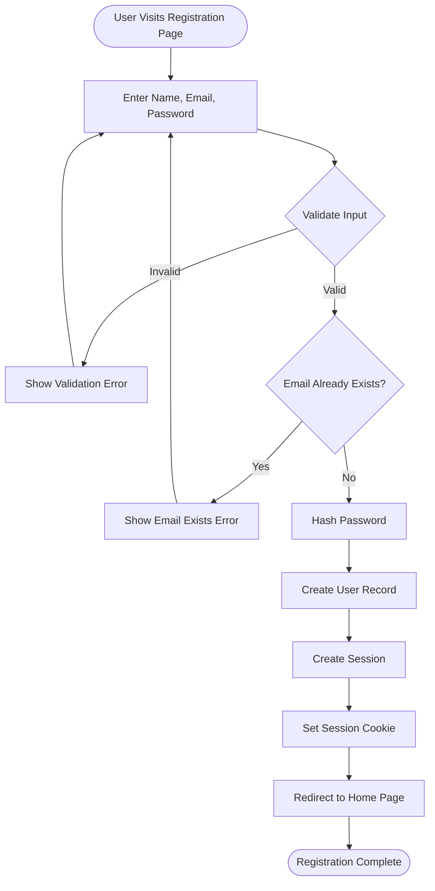
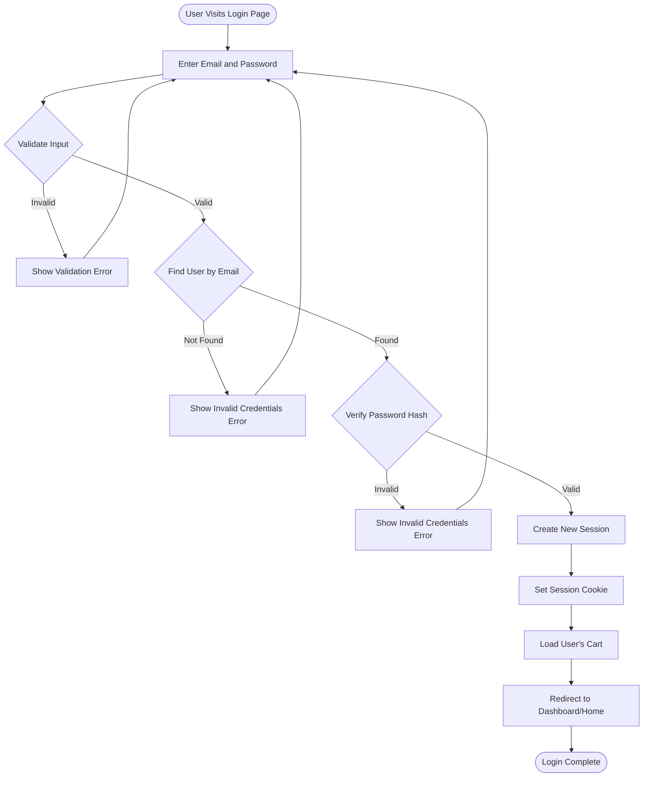
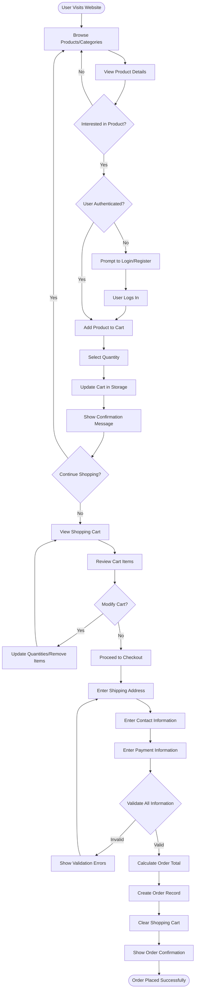
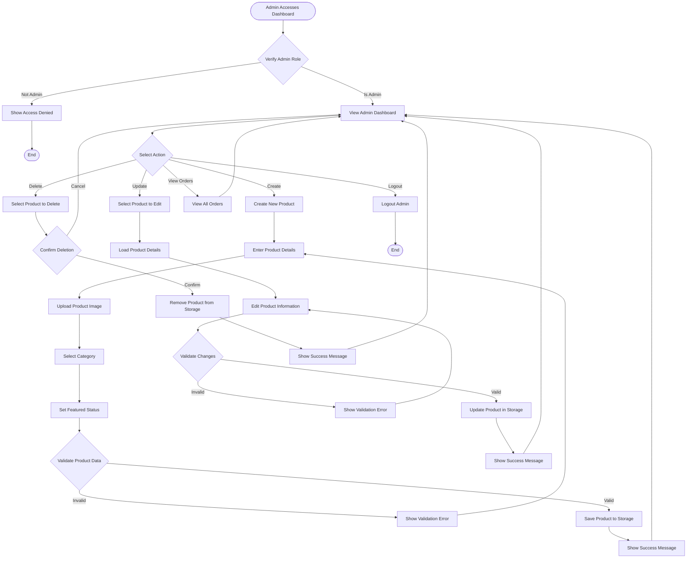
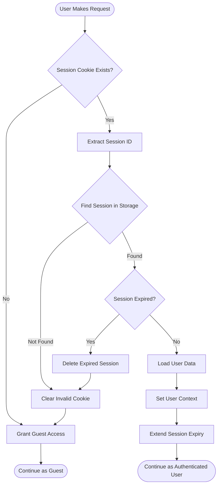
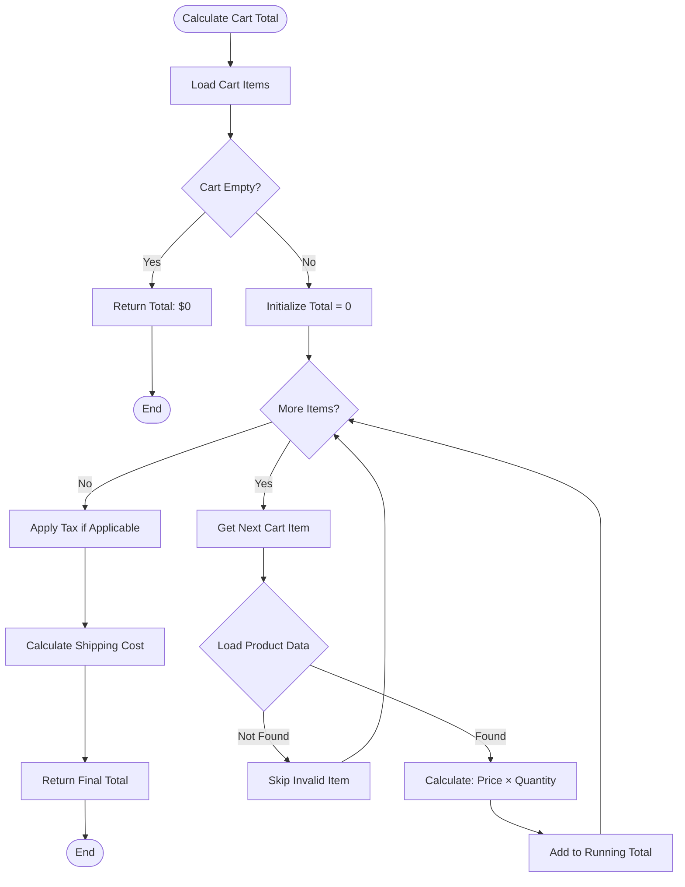

# FloraLink - Activity Diagrams

This document contains activity diagrams for key workflows in the FloraLink eCommerce system.

## 1. User Registration Flow

## 2. User Login Flow

## 3. Shopping Flow (Browse → Add to Cart → Checkout)

## 4. Admin Product Management Flow

## 5. Session Management Flow

## 6. Cart Calculation Flow

## Workflow Notes

### Key Decision Points
1. **Authentication Checks**: Required before cart operations and checkout
2. **Validation Steps**: Input validation at multiple stages to ensure data integrity
3. **Admin Authorization**: Role-based access control for administrative functions
4. **Session Management**: Automatic session validation and renewal

### Error Handling
- All workflows include validation and error feedback loops
- Users can retry operations after correcting errors
- Invalid sessions automatically redirect to guest access

### Performance Considerations
- Cart calculations performed client-side for responsiveness
- Session validation on each request for security
- Lazy loading of product details to optimize browsing
