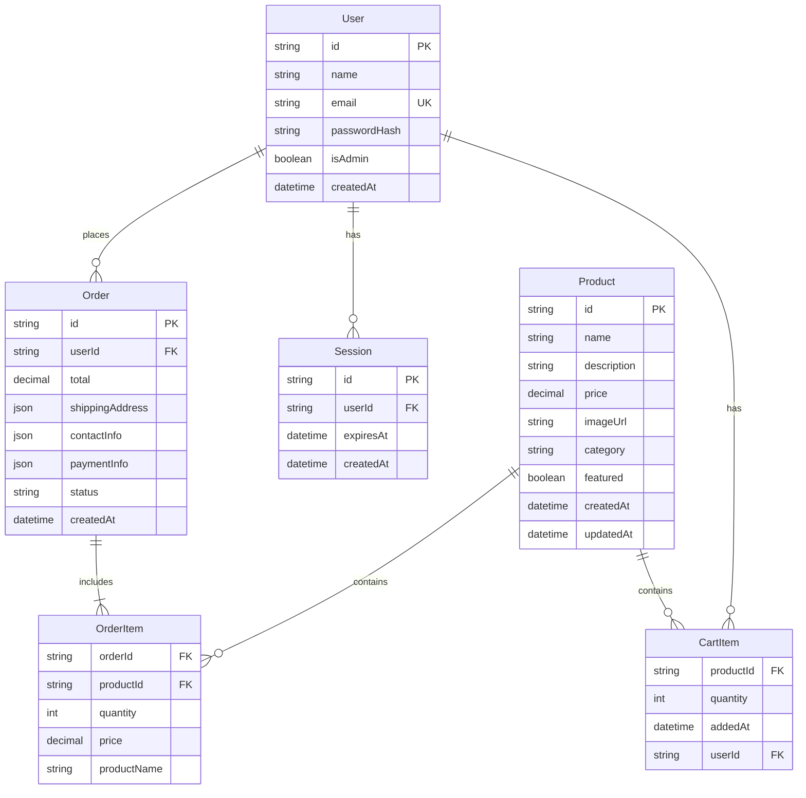

# FloraLink - Entity Relationship Diagram (ERD)

This diagram shows the database schema and relationships between entities in the FloraLink eCommerce system.



## Entity Descriptions

### User
- **Primary Key**: id
- **Unique Key**: email
- **Purpose**: Stores customer and administrator account information
- **Relationships**: 
  - One user can place many orders
  - One user can have many sessions
  - One user can have many cart items

### Product
- **Primary Key**: id
- **Purpose**: Stores flower product catalog information
- **Categories**: Romantic, Sympathy & Funeral, Wedding & Engagement, Celebrations, Seasonal & Special Days
- **Relationships**:
  - One product can be in many cart items
  - One product can be in many order items

### CartItem
- **Composite Key**: userId + productId
- **Purpose**: Stores temporary shopping cart data for users
- **Relationships**:
  - Many cart items belong to one user
  - Many cart items reference one product

### Order
- **Primary Key**: id
- **Foreign Key**: userId
- **Purpose**: Stores completed purchase transactions
- **Status Values**: pending, processing, shipped, delivered, cancelled
- **Relationships**:
  - Many orders belong to one user
  - One order contains many order items

### OrderItem
- **Composite Key**: orderId + productId
- **Purpose**: Stores individual products within an order (denormalized for historical data)
- **Relationships**:
  - Many order items belong to one order
  - Many order items reference one product

### Session
- **Primary Key**: id
- **Foreign Key**: userId
- **Purpose**: Manages user authentication sessions
- **Relationships**:
  - Many sessions belong to one user
```
