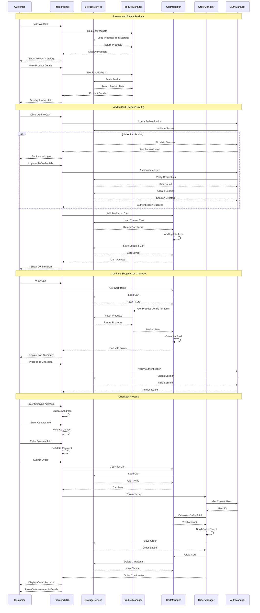

# FloraLink - Swimlane Diagrams

This document contains swimlane diagrams showing interactions between different system components and actors.

## 1. Complete Purchase Process

## 2. Admin Product Management Process

```mermaid
sequenceDiagram
    participant A as Administrator
    participant F as Frontend (Admin UI)
    participant AM as AuthManager
    participant PM as ProductManager
    participant S as StorageService

    Note over A,S: Admin Login
    A->>F: Access Admin Dashboard
    F->>AM: Check Authentication
    AM->>S: Validate Session
    
    alt Not Authenticated
        S-->>AM: No Session
        AM-->>F: Not Authenticated
        F-->>A: Redirect to Login
        A->>F: Enter Admin Credentials
        F->>AM: Authenticate
        AM->>S: Verify Credentials & Admin Role
        S-->>AM: Admin User Found
        AM->>S: Create Session
        S-->>AM: Session Created
        AM-->>F: Authentication Success
    else Not Admin
        S-->>AM: User Not Admin
        AM-->>F: Access Denied
        F-->>A: Show Access Denied Message
    end
    
    Note over A,S: View Products
    F->>PM: Request All Products
    PM->>S: Load Products
    S-->>PM: Return Products
    PM-->>F: Product List
    F-->>A: Display Products in Admin View
    
    Note over A,S: Create New Product
    A->>F: Click "Add New Product"
    F-->>A: Show Product Form
    A->>F: Enter Product Details
    A->>F: Upload Image
    A->>F: Select Category
    A->>F: Set Featured Status
    A->>F: Submit Form
    
    F->>F: Validate Input
    alt Validation Failed
        F-->>A: Show Validation Errors
    else Validation Passed
        F->>PM: Create Product
        PM->>PM: Generate Product ID
        PM->>PM: Set Timestamps
        PM->>S: Save Product
        S-->>PM: Product Saved
        PM-->>F: Success
        F-->>A: Show Success Message
        F->>PM: Refresh Product List
        PM->>S: Load Products
        S-->>PM: Return Updated Products
        PM-->>F: Updated Product List
        F-->>A: Display Updated Products
    end
    
    Note over A,S: Update Existing Product
    A->>F: Select Product to Edit
    F->>PM: Get Product Details
    PM->>S: Load Product by ID
    S-->>PM: Return Product
    PM-->>F: Product Data
    F-->>A: Show Edit Form with Data
    
    A->>F: Modify Product Details
    A->>F: Submit Changes
    F->>F: Validate Input
    
    alt Validation Failed
        F-->>A: Show Validation Errors
    else Validation Passed
        F->>PM: Update Product
        PM->>PM: Update Timestamp
        PM->>S: Save Updated Product
        S-->>PM: Product Updated
        PM-->>F: Success
        F-->>A: Show Success Message
        F->>PM: Refresh Product List
        PM->>S: Load Products
        S-->>PM: Return Updated Products
        PM-->>F: Updated Product List
        F-->>A: Display Updated Products
    end
    
    Note over A,S: Delete Product
    A->>F: Select Product to Delete
    F-->>A: Show Confirmation Dialog
    A->>F: Confirm Deletion
    
    F->>PM: Delete Product
    PM->>S: Remove Product by ID
    S-->>PM: Product Deleted
    PM-->>F: Success
    F-->>A: Show Success Message
    F->>PM: Refresh Product List
    PM->>S: Load Products
    S-->>PM: Return Updated Products
    PM-->>F: Updated Product List
    F-->>A: Display Updated Products
    
    Note over A,S: View Orders
    A->>F: Navigate to Orders
    F->>OM: Request All Orders
    OM->>S: Load Orders
    S-->>OM: Return Orders
    OM-->>F: Order List
    F-->>A: Display All Orders
    
    A->>F: Select Order to View
    F->>OM: Get Order Details
    OM->>S: Load Order by ID
    S-->>OM: Return Order
    OM-->>F: Order Data
    F-->>A: Display Order Details
    
    A->>F: Update Order Status
    F->>OM: Update Order
    OM->>S: Save Updated Order
    S-->>OM: Order Updated
    OM-->>F: Success
    F-->>A: Show Success Message
```

## 3. User Authentication Flow (Detailed)

```mermaid
sequenceDiagram
    participant U as User
    participant F as Frontend
    participant AM as AuthManager
    participant S as StorageService

    Note over U,S: Registration Process
    U->>F: Click "Register"
    F-->>U: Show Registration Form
    U->>F: Enter Name, Email, Password
    U->>F: Submit Form
    
    F->>F: Validate Input Format
    alt Invalid Format
        F-->>U: Show Format Errors
    else Valid Format
        F->>AM: Register User
        AM->>S: Check Email Exists
        S-->>AM: Email Check Result
        
        alt Email Already Exists
            AM-->>F: Email Taken Error
            F-->>U: Show Email Exists Message
        else Email Available
            AM->>AM: Hash Password
            AM->>AM: Generate User ID
            AM->>S: Save User
            S-->>AM: User Created
            AM->>AM: Generate Session ID
            AM->>S: Save Session
            S-->>AM: Session Created
            AM-->>F: Registration Success + Session
            F->>F: Set Session Cookie
            F-->>U: Redirect to Home (Logged In)
        end
    end
    
    Note over U,S: Login Process
    U->>F: Click "Login"
    F-->>U: Show Login Form
    U->>F: Enter Email, Password
    U->>F: Submit Form
    
    F->>F: Validate Input
    alt Invalid Input
        F-->>U: Show Validation Errors
    else Valid Input
        F->>AM: Authenticate User
        AM->>S: Find User by Email
        S-->>AM: User Data or Not Found
        
        alt User Not Found
            AM-->>F: Invalid Credentials
            F-->>U: Show Error Message
        else User Found
            AM->>AM: Verify Password Hash
            
            alt Password Invalid
                AM-->>F: Invalid Credentials
                F-->>U: Show Error Message
            else Password Valid
                AM->>AM: Generate Session ID
                AM->>S: Save Session
                S-->>AM: Session Created
                AM-->>F: Login Success + Session
                F->>F: Set Session Cookie
                F-->>U: Redirect to Dashboard
            end
        end
    end
    
    Note over U,S: Session Validation (Every Request)
    U->>F: Make Request
    F->>F: Extract Session Cookie
    
    alt No Cookie
        F->>F: Continue as Guest
    else Cookie Exists
        F->>AM: Validate Session
        AM->>S: Find Session by ID
        S-->>AM: Session Data or Not Found
        
        alt Session Not Found
            AM-->>F: Invalid Session
            F->>F: Clear Cookie
            F->>F: Continue as Guest
        else Session Found
            AM->>AM: Check Expiry
            
            alt Session Expired
                AM->>S: Delete Session
                S-->>AM: Deleted
                AM-->>F: Session Expired
                F->>F: Clear Cookie
                F->>F: Continue as Guest
            else Session Valid
                AM->>S: Load User Data
                S-->>AM: User Data
                AM->>S: Extend Session Expiry
                S-->>AM: Session Updated
                AM-->>F: User Context
                F->>F: Set User State
            end
        end
    end
    
    Note over U,S: Logout Process
    U->>F: Click "Logout"
    F->>AM: Logout User
    AM->>S: Delete Session
    S-->>AM: Session Deleted
    AM-->>F: Logout Success
    F->>F: Clear Session Cookie
    F->>F: Clear User State
    F-->>U: Redirect to Home (Guest)
```

## Component Responsibilities

### Customer
- Initiates all user-facing actions
- Provides input data (credentials, shipping info, etc.)
- Makes purchasing decisions

### Frontend (UI)
- Renders user interface
- Validates user input
- Manages client-side state
- Coordinates between managers
- Handles routing and navigation

### StorageService
- Persists all data (localStorage)
- Provides CRUD operations
- Manages data consistency
- Returns requested data

### ProductManager
- Manages product catalog
- Handles product CRUD operations
- Filters and searches products
- Manages categories and featured products

### CartManager
- Manages shopping cart state
- Calculates cart totals
- Adds/updates/removes cart items
- Validates cart contents

### OrderManager
- Creates and manages orders
- Processes checkout
- Tracks order status
- Generates order confirmations

### AuthManager
- Handles user authentication
- Manages sessions
- Validates credentials
- Controls access based on roles

## Key Interaction Patterns

1. **Authentication Gate**: Most operations require session validation before proceeding
2. **Manager Coordination**: Frontend coordinates between multiple managers for complex operations
3. **Data Flow**: All persistent data flows through StorageService
4. **Validation Layers**: Input validation at frontend, business logic validation at managers
5. **Error Handling**: Each component returns success/error status for proper user feedback
