# FloraLink - Use Case Diagram

This diagram illustrates the different actors and their interactions with the FloraLink eCommerce system.

```mermaid
graph TB
    subgraph Actors
        Guest[Guest User]
        Registered[Registered User]
        Admin[Administrator]
    end

    subgraph "Product Browsing"
        UC1[Browse Products]
        UC2[View Categories]
        UC3[View Product Details]
        UC4[Search Products]
        UC5[View Featured Products]
    end

    subgraph "Authentication"
        UC6[Register Account]
        UC7[Login]
        UC8[Logout]
        UC9[Manage Session]
    end

    subgraph "Shopping Cart"
        UC10[Add to Cart]
        UC11[Update Cart Quantity]
        UC12[Remove from Cart]
        UC13[View Cart]
        UC14[Calculate Cart Total]
    end

    subgraph "Order Management"
        UC15[Checkout]
        UC16[Enter Shipping Info]
        UC17[Enter Payment Info]
        UC18[Place Order]
        UC19[View Order History]
        UC20[View Order Details]
    end

    subgraph "Admin - Product Management"
        UC21[Create Product]
        UC22[Update Product]
        UC23[Delete Product]
        UC24[Manage Categories]
        UC25[Set Featured Products]
    end

    subgraph "Admin - Order Management"
        UC26[View All Orders]
        UC27[Update Order Status]
        UC28[View Order Analytics]
    end

    subgraph "Admin - User Management"
        UC29[View All Users]
        UC30[Manage User Roles]
        UC31[View User Activity]
    end

    %% Guest User Capabilities
    Guest --> UC1
    Guest --> UC2
    Guest --> UC3
    Guest --> UC4
    Guest --> UC5
    Guest --> UC6
    Guest --> UC7

    %% Registered User Capabilities (inherits Guest + additional)
    Registered --> UC1
    Registered --> UC2
    Registered --> UC3
    Registered --> UC4
    Registered --> UC5
    Registered --> UC8
    Registered --> UC10
    Registered --> UC11
    Registered --> UC12
    Registered --> UC13
    Registered --> UC14
    Registered --> UC15
    Registered --> UC16
    Registered --> UC17
    Registered --> UC18
    Registered --> UC19
    Registered --> UC20

    %% Administrator Capabilities (inherits Registered + additional)
    Admin --> UC1
    Admin --> UC2
    Admin --> UC3
    Admin --> UC4
    Admin --> UC5
    Admin --> UC8
    Admin --> UC10
    Admin --> UC11
    Admin --> UC12
    Admin --> UC13
    Admin --> UC14
    Admin --> UC15
    Admin --> UC16
    Admin --> UC17
    Admin --> UC18
    Admin --> UC19
    Admin --> UC20
    Admin --> UC21
    Admin --> UC22
    Admin --> UC23
    Admin --> UC24
    Admin --> UC25
    Admin --> UC26
    Admin --> UC27
    Admin --> UC28
    Admin --> UC29
    Admin --> UC30
    Admin --> UC31

    %% Use Case Dependencies
    UC15 -.->|requires| UC7
    UC18 -.->|includes| UC16
    UC18 -.->|includes| UC17
    UC10 -.->|requires| UC7
    UC21 -.->|requires| UC7
    UC22 -.->|requires| UC7
    UC23 -.->|requires| UC7
```

## Actor Descriptions

### Guest User
**Description**: Unauthenticated visitors to the FloraLink website

**Capabilities**:
- Browse and search the product catalog
- View product details and categories
- View featured products
- Register for a new account
- Login to existing account

**Limitations**:
- Cannot add items to cart
- Cannot make purchases
- Cannot view order history

### Registered User
**Description**: Authenticated customers with active accounts

**Capabilities**:
- All Guest User capabilities
- Add products to shopping cart
- Manage cart items (update quantity, remove)
- Complete checkout process
- View personal order history
- Logout from account

**Limitations**:
- Cannot access admin functions
- Cannot manage products or other users

### Administrator
**Description**: System administrators with elevated privileges

**Capabilities**:
- All Registered User capabilities
- Create, update, and delete products
- Manage product categories
- Set featured products
- View all customer orders
- Update order status
- View order analytics
- Manage user accounts and roles
- View user activity logs

## Use Case Details

### High Priority Use Cases
1. **Browse Products** - Core functionality for all users
2. **Add to Cart** - Essential for shopping experience
3. **Checkout** - Critical for revenue generation
4. **Manage Products** - Essential for admin operations

### Security Requirements
- Authentication required for: Cart operations, Checkout, Order history, All admin functions
- Session management for maintaining user state
- Role-based access control for admin functions
